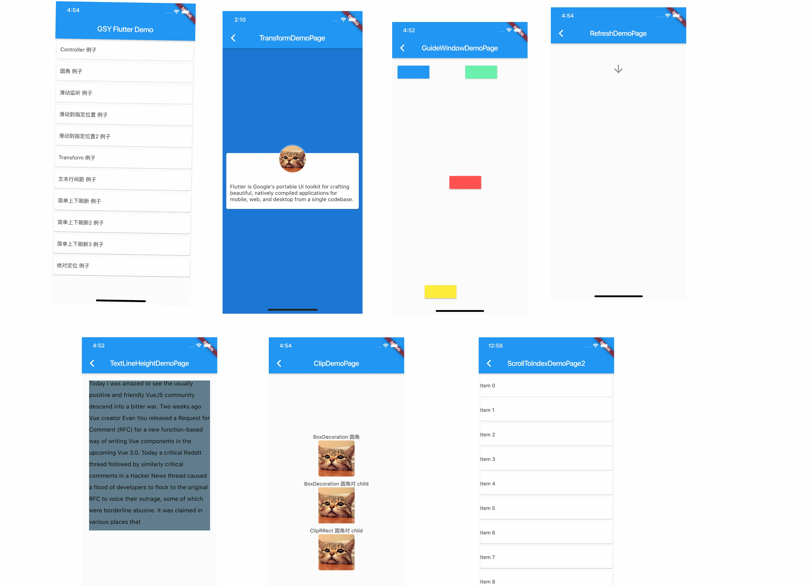

## GSY Flutter Demo

### 不同于 [GSYGithubAppFlutter](https://github.com/CarGuo/GSYGithubAppFlutter) 项目，本项目将逐步完善各种 Flutter 独立例子，方便新手学习上手。

> 目前开始逐步补全完善，主要提供一些有用或者有趣的例子，如果你也有好例子，环境提交 PR 。

### 已有例子

- **Controller 例子**
- **圆角 例子**
- **滑动监听 例子**
- **滑动到指定位置 例子**
- **滑动到指定位置2 例子**
- **Transform 例子**
- **文本行间距 例子**
- **多种下拉刷新 例子**
- **绝对定位 例子**
- **气泡提示框 例子**
- **标签Wrap 例子**
- **共享元素动画 例子**

## 相关文章

* ### [Flutter 完整开发实战详解(一、Dart 语言和 Flutter 基础)](https://juejin.im/entry/5b631e3e51882519861c2ef1 )
* ### [Flutter 完整开发实战详解(二、快速实战篇)](https://juejin.im/entry/5b685bd4e51d451994602cae )
* ### [Flutter 完整开发实战详解(三、打包填坑篇)](https://juejin.im/entry/5b6fd5ee6fb9a009d36a4104 )
* ### [Flutter 完整开发实战详解(四、Redux、主题、国际化)](https://juejin.im/post/5b79767ff265da435450a873 )
* ### [Flutter 完整开发实战详解(五、深入探索)](https://juejin.im/post/5bc450dff265da0a951f032b )
* ### [Flutter 完整开发实战详解(六、 深入Widget原理)](https://juejin.im/post/5c7e853151882549664b0543 )
* ### [Flutter 完整开发实战详解(七、 深入布局原理)](https://juejin.im/post/5c8c6ef7e51d450ba7233f51 )
* ### [Flutter 完整开发实战详解(八、 实用技巧与填坑)](https://juejin.im/post/5c9e328251882567b91e1cfb)
* ### [Flutter 完整开发实战详解(九、 深入绘制原理)](https://juejin.im/post/5ca0e0aff265da309728659a)
* ### [Flutter 完整开发实战详解(十、 深入图片加载流程)](https://juejin.im/post/5cb1896ce51d456e63760449)
* ### [Flutter 完整开发实战详解(十一、全面深入理解Stream)](https://juejin.im/post/5cc2acf86fb9a0321f042041)
* ### [Flutter 完整开发实战详解(十二、全面深入理解状态管理设计)](https://juejin.im/post/5cc816866fb9a03231209c7c)
* ### [Flutter 完整开发实战详解(十三、全面深入触摸和滑动原理)](https://juejin.im/post/5cd54839f265da03b2044c32)
* ### [Flutter 完整开发实战详解(十四、混合开发打包 Android 篇)](https://juejin.im/post/5cf527036fb9a07ed911acd8)
* ### [Flutter 完整开发实战详解(十五、全面理解State与Provider)](https://juejin.im/post/5d0634c7f265da1b91639232)

----
* ### [全网最全 Flutter 与 React Native 深入对比分析](https://juejin.im/post/5d0bac156fb9a07ec56e7f15)
* ### [Flutter 番外篇之面试知识点集锦](https://juejin.im/post/5cd9875ae51d453d022cb662)
* ### [Flutter 开发实战与前景展望 - RTC Dev Meetup](https://juejin.im/post/5ce7ddf95188257a2b1eac8a)
* ### [目前各种主流状态管理演示Demo](https://github.com/CarGuo/state_manager_demo)

----

- ## [Flutter 完整开发实战详解 Gitbook 预览下载](https://github.com/CarGuo/GSYFlutterBook)
